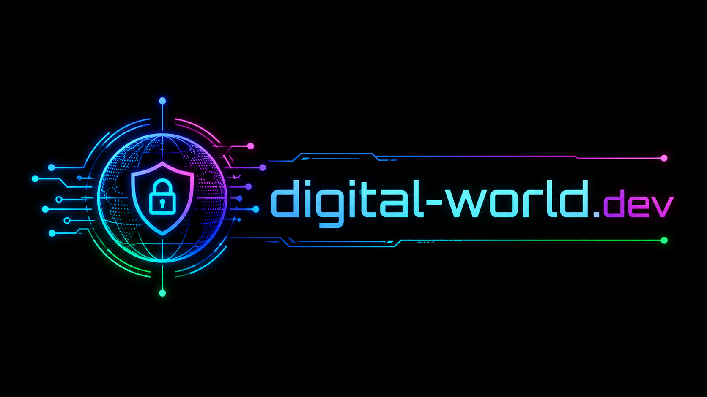

# Digital World YouTube Transcriber

Desktop-App fuer Windows, die YouTube- und TikTok-Videos mit `yt-dlp` herunterlaedt und sie anschliessend lokal mit OpenAI Whisper transkribiert. Die Videodatei und die exportierten Transkripte landen standardmaessig im gleichen Zielordner, z. B. `I:\transkriptions`.



## Features

- YouTube- oder TikTok-URL einfuegen und Download starten
- Automatische Ablage im konfigurierbaren Zielordner
- Transkription mit OpenAI Whisper
- Whisper-Modell waehlen: `tiny`, `base`, `small`, `medium`, `large`
- Sprache waehlen: Deutsch, Englisch oder Auto-Erkennung
- Export als `.txt`, `.md` und `.pdf`
- Zeitstempel optional im Export
- Update-Check gegen GitHub Releases mit Installer-Download
- Tool-Pfade fuer `yt-dlp.exe` und `whisper.exe` automatisch erkennen oder manuell speichern
- Protokollansicht fuer Download und Transkription
- Info-Tab mit Version, Erstellungsmonat, Website und Kontakt
- Digital-World-Logo als App-Header und Windows-Icon

## App-Info

- App Name: Digital World YouTube Transcriber
- Version: 1.1.2
- Erstellt: Mai 2026
- Website: https://digital-world.dev
- Kontakt: kontakt@digital-world.dev

## Installation

### Portable EXE

Die fertige Windows-App liegt nach dem Build hier:

```powershell
.\app\dist\Digital-World-YouTube-Transcriber.exe
```

### Installer-Paket

Das aktuelle Release enthaelt einen einfachen Windows-Installer:

```powershell
.\app\release\Digital-World-YouTube-Transcriber-1.1.2\Digital-World-YouTube-Transcriber-Installer-1.1.2.exe
```

Dieser Installer fragt den Installationsort ab, erstellt Verknuepfungen und startet danach das Dependency-Skript fuer `yt-dlp`, OpenAI Whisper und FFmpeg. Wird kein Ordner gewaehlt, nutzt er `%LOCALAPPDATA%\Programs\Digital World YouTube Transcriber`.

Das Projekt enthaelt ein Inno-Setup-Skript:

```text
app\installer\Digital-World-YouTube-Transcriber.iss
```

Wenn Inno Setup 6 installiert ist, erzeugt `app\build-release.cmd` automatisch einen Setup-Installer. Der Installer kann nach der App-Installation optional diese Laufzeit-Abhaengigkeiten installieren oder aktualisieren:

- Python 3, falls ueber `winget` verfuegbar
- `yt-dlp`
- `openai-whisper`
- `typing_extensions`
- FFmpeg ueber `winget`

Ohne Inno Setup wird trotzdem ein Release-Ordner mit EXE, README, Runtime-Anforderungen und Installer-Skript erstellt.

## Code Signing und SmartScreen

Windows Defender SmartScreen warnt bei unbekannten oder unsignierten Apps. Fuer eine oeffentliche Version sollte die EXE mit einem Code-Signing-Zertifikat oder einem Microsoft Signing-Dienst signiert werden. Der Build unterstuetzt das bereits automatisch:

```powershell
$env:CODESIGN_CERT_PATH = "C:\Pfad\zu\certificate.pfx"
$env:CODESIGN_CERT_PASSWORD = "pfx-passwort"
.\app\build-release.cmd
```

Alternativ kann ein Zertifikat aus dem Windows-Zertifikatsspeicher genutzt werden:

```powershell
$env:CODESIGN_CERT_SUBJECT = "Digital World"
.\app\build-release.cmd
```

Ohne Zertifikat wird das Signieren uebersprungen und SmartScreen kann weiterhin erscheinen.

## Voraussetzungen

Fuer die Transkription braucht Windows:

- Python 3.11 oder neuer
- `yt-dlp`
- `openai-whisper`
- FFmpeg im PATH

Die Abhaengigkeiten koennen manuell installiert werden:

```powershell
python -m pip install --upgrade yt-dlp openai-whisper typing_extensions
winget install --id Gyan.FFmpeg -e --source winget
```

## Entwicklung

Script-Version starten:

```powershell
.\app\Start-YouTube-Transcriber.cmd
```

Release neu bauen:

```powershell
.\app\build-release.cmd
```

Der Build erzeugt:

- `app\dist\Digital-World-YouTube-Transcriber.exe`
- `app\dist\Digital-World-YouTube-Transcriber-Installer-1.1.2.exe`
- `app\release\Digital-World-YouTube-Transcriber-1.1.2\`
- `app\release\Digital-World-YouTube-Transcriber-1.1.2.zip`
- optional `app\dist\Digital-World-YouTube-Transcriber-Setup-1.1.2.exe`, wenn Inno Setup installiert ist

## GitHub-Beschreibung

**Kurzbeschreibung:**  
Windows desktop app for downloading YouTube and TikTok videos with yt-dlp and transcribing them locally with OpenAI Whisper.

**Ausfuehrliche Beschreibung:**  
Digital World YouTube Transcriber is a small Windows desktop tool for creators, researchers and teams that frequently transcribe online videos. Paste a YouTube or TikTok URL, choose an output folder, download the video with yt-dlp and generate local Whisper transcripts in TXT, Markdown or PDF. Optional timestamps, saved preferences, update checks and release assets make it a practical base for a future Pro version.

## Rechtlicher Hinweis

Bitte nur Inhalte herunterladen und transkribieren, fuer die du die notwendigen Rechte oder eine entsprechende Erlaubnis hast. YouTube-Nutzungsbedingungen und Urheberrechte muessen beachtet werden.
